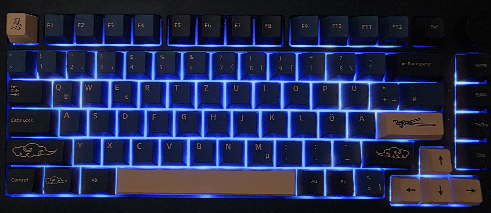
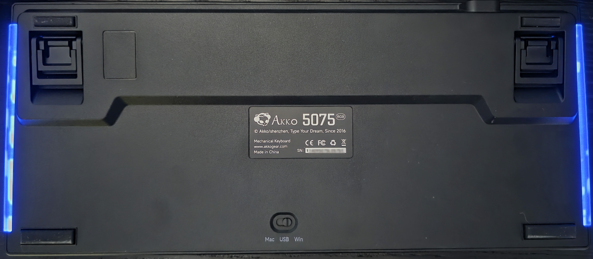

# AKKO 5075 — Custom QMK Firmware (ISO-DE)

> **Deutsches QWERTZ-Layout** mit reaktiver RGB-Beleuchtung, persistenten Basisfarben und VIA-Support — portiert für die AKKO 5075 Tastatur (WB32FQ95 MCU).

---

## Fotos

| Vorderseite | Rückseite |
|:-----------:|:---------:|
|  |  |

---

## Features

| Feature | Details |
|---|---|
| 🇩🇪 **Deutsches QWERTZ** | Vollständiges ISO-DE Layout mit Ä, Ö, Ü, ß, toten Akzenten |
| 🌈 **RGB-Basisfarben** | 10 wählbare Farben + Aus, EEPROM-persistent über Neustarts |
| ✨ **Reaktive Effekte** | ESC/Enter → roter Welleneffekt · alle anderen Tasten → grüner Blitz |
| 🔊 **Encoder** | Drehen = Lautstärke · im Fn-Layer = Helligkeit |
| ⌨️ **VIA-kompatibel** | Keymap per VIA-App live bearbeitbar |
| ⏱️ **Debounce 25 ms** | Verhindert Tastenkontaktrauschen (Chatter) |
| 🎵 **Medientasten** | Fn + Y/X/C/V/B/N/M |
| 💡 **Bootloader-Zugang** | Fn + ESC |
| 🗑️ **EEPROM-Reset** | Fn + Backspace |

---

## Tastatur-Layout

### Base Layer

```
     ┌──────┬────┬────┬────┬────┬────┬────┬────┬────┬────┬────┬────┬────┬──────┬──────┐
FN   │ ESC  │ F1 │ F2 │ F3 │ F4 │ F5 │ F6 │ F7 │ F8 │ F9 │F10 │F11 │F12 │ DEL  │ (◎) │
     └──────┴────┴────┴────┴────┴────┴────┴────┴────┴────┴────┴────┴────┴──────┴──────┘
     ┌──────┬────┬────┬────┬────┬────┬────┬────┬────┬────┬────┬────┬────┬────────┬────┐
R1   │ ^/°  │ 1! │ 2" │ 3§ │ 4$ │ 5% │ 6& │ 7/ │ 8( │ 9) │ 0= │ ß? │ ´` │ Bksp   │Hom │
     └──────┴────┴────┴────┴────┴────┴────┴────┴────┴────┴────┴────┴────┴────────┴────┘
     ┌───────┬────┬────┬────┬────┬────┬────┬────┬────┬────┬────┬────┬────┬────┬────┐
R2   │  Tab  │ Q  │ W  │ E  │ R  │ T  │ Z  │ U  │ I  │ O  │ P  │ Ü  │+/* │#/' │PgU │
     └───────┴────┴────┴────┴────┴────┴────┴────┴────┴────┴────┴────┴────┴────┴────┘
     ┌─────────┬────┬────┬────┬────┬────┬────┬────┬────┬────┬────┬────┬────────────┬────┐
R3   │CapsLock │ A  │ S  │ D  │ F  │ G  │ H  │ J  │ K  │ L  │ Ö  │ Ä  │   Enter    │PgD │
     └─────────┴────┴────┴────┴────┴────┴────┴────┴────┴────┴────┴────┴────────────┴────┘
     ┌──────────┬────┬────┬────┬────┬────┬────┬────┬────┬────┬────┬───────────┬────┬────┐
R4   │ L-Shift  │ Y  │ X  │ C  │ V  │ B  │ N  │ M  │,/; │./: │-/_ │  R-Shift  │ ↑  │End │
     └──────────┴────┴────┴────┴────┴────┴────┴────┴────┴────┴────┴───────────┴────┴────┘
     ┌──────┬──────┬──────┬────────────────────────┬───────┬────┬─────┬────┬────┬────┐
R5   │ Strg │ Win  │ Alt  │         Space          │ AltGr │ Fn │ <>| │ ←  │ ↓  │ →  │
     └──────┴──────┴──────┴────────────────────────┴───────┴────┴─────┴────┴────┴────┘

◎ = Rotary Encoder (drehen: Lautstärke, drücken: Mute)
<>| = Spitzklammer-/Pipe-Taste (ISO-DE Taste, jetzt auf Fn-Reihe)
```

### Fn-Layer

```
     ┌──────┬────┬────┬────┬────┬────┬────┬────┬────┬────┬────┬────┬────┬──────┬──────┐
FN   │BOOTL │    │    │    │    │    │    │    │    │    │    │    │    │      │RGB++ │
     └──────┴────┴────┴────┴────┴────┴────┴────┴────┴────┴────┴────┴────┴──────┴──────┘
     ┌──────┬────┬────┬────┬────┬────┬────┬────┬────┬────┬────┬────┬────┬────────┬────┐
R1   │      │ F1 │ F2 │ F3 │ F4 │ F5 │ F6 │ F7 │ F8 │ F9 │F10 │F11 │F12 │EE_CLR  │Hom │
     └──────┴────┴────┴────┴────┴────┴────┴────┴────┴────┴────┴────┴────┴────────┴────┘
     ┌───────┬────┬────┬────┬────┬────┬────┬────┬────┬────┬────┬────┬────┬────┬────┐
R2   │       │    │    │    │    │    │    │    │    │    │    │    │    │    │End │
     └───────┴────┴────┴────┴────┴────┴────┴────┴────┴────┴────┴────┴────┴────┴────┘
     ┌─────────┬────┬────┬────┬────┬────┬────┬────┬────┬────┬────┬────┬────────────┬────┐
R3   │         │    │    │    │    │    │    │    │    │    │    │    │            │    │
     └─────────┴────┴────┴────┴────┴────┴────┴────┴────┴────┴────┴────┴────────────┴────┘
     ┌──────────┬────┬────┬────┬────┬────┬────┬────┬────┬────┬────┬───────────┬────┬────┐
R4   │          │Prv │Stp │Ply │Nxt │Mut │V+  │V-  │    │    │    │           │ B+ │    │
     └──────────┴────┴────┴────┴────┴────┴────┴────┴────┴────┴────┴───────────┴────┴────┘
     ┌──────┬──────┬──────┬────────────────────────┬───────┬────┬─────┬─────┬────┬─────┐
R5   │      │      │      │                        │       │    │     │Clr- │ B- │Clr+ │
     └──────┴──────┴──────┴────────────────────────┴───────┴────┴─────┴─────┴────┴─────┘

BOOTL = Bootloader-Modus (zum Flashen)
EE_CLR = EEPROM löschen (VIA-Keymap-Cache zurücksetzen)
B+ / B- = RGB-Helligkeit erhöhen / verringern
Clr+ / Clr- = Nächste / Vorherige Basisfarbe
RGB++ = Nächster RGB-Modus
```

### AltGr-Belegung (Betriebssystem steuert dies)

```
AltGr + Q  = @      AltGr + E  = €      AltGr + 7  = {
AltGr + 8  = [      AltGr + 9  = ]      AltGr + 0  = }
AltGr + ß  = \      AltGr + +  = ~      AltGr + <>| = |
```

### RGB-Basisfarben (Fn + → / ←)

| Index | Farbe | Index | Farbe |
|---|---|---|---|
| 0 | 🔵 Blau (Standard) | 5 | 🟠 Orange |
| 1 | 🟡 Gelb | 6 | 🟢 Hellgrün |
| 2 | 🟣 Violett | 7 | ⚪ Weiß |
| 3 | 🩷 Rosa | 8 | 🔴 Rot |
| 4 | 🩵 Türkis | 9 | ⚫ Aus |

---

## Installation

### Voraussetzungen

- **QMK Toolbox** → [Download](https://github.com/qmk/qmk_toolbox/releases)
- Die Firmware-Datei: `akko_5075_iso_de_custom.bin`
- Windows Keyboard-Layout auf **Deutsch (Deutschland)** oder **Deutsch (Österreich)** eingestellt

### Schritt 1 — Tastatur in den Bootloader-Modus bringen

**Methode A** (Tastatur bereits mit dieser Firmware geflasht):
- `Fn + ESC` drücken → Tastatur wechselt in den DFU-Modus

**Methode B** (Erstinstallation / Original-Firmware):
- `ESC` gedrückt halten + USB-Kabel einstecken → DFU-Modus

### Schritt 2 — Flashen mit QMK Toolbox

1. QMK Toolbox öffnen
2. `akko_5075_iso_de_custom.bin` über **„Open"** laden
3. Auf **„Flash"** klicken
4. Warten bis `"Flash complete"` erscheint
5. Tastatur trennen und neu anschließen

### Schritt 3 — EEPROM zurücksetzen (Erstinstallation oder nach Firmware-Update)

> Dieser Schritt ist nötig, wenn die Tastatur zuvor eine VIA-fähige Firmware hatte.
> VIA speichert den Keymap im EEPROM — dieser muss einmal geleert werden.

1. `Fn + Backspace` drücken
2. Die RGB-LEDs blinken kurz → EEPROM wurde gelöscht
3. Die Tastatur bootet neu mit dem kompilierten Keymap ✅

---

## Selbst kompilieren

### Voraussetzungen

- [QMK MSYS](https://msys.qmk.fm/) (Windows) oder QMK unter Linux/macOS
- Dieses Repository

### Setup

```bash
# 1. QMK Firmware klonen
git clone https://github.com/qmk/qmk_firmware.git
cd qmk_firmware
make git-submodule

# 2. Keymap-Dateien kopieren
cp -r /path/to/this/repo/keymap keyboards/akko/5075/keymaps/iso_de_custom

# 3. Kompilieren
qmk compile -kb akko/5075 -km iso_de_custom
# oder: make akko/5075:iso_de_custom
```

Die fertige `.bin`-Datei liegt dann im `qmk_firmware`-Stammverzeichnis.

---

## Projektstruktur

```
akko_5075-iso-de-custom/
├── README.md                          # Diese Datei
├── LICENSE                            # GNU GPL v2
├── front.png                          # Tastatur-Foto Vorderseite
├── back.png                           # Tastatur-Foto Rückseite
├── akko_5075_iso_de_custom.bin        # Vorkompilierte Firmware
└── keymap/
    ├── keymap.c                       # Haupt-Keymap mit RGB-Logik
    ├── config.h                       # Debounce, RGB-Defaults
    └── rules.mk                       # VIA + Encoder-Map aktivieren
```

---

## Danksagungen & Quellen

Dieses Projekt wäre ohne folgende Vorarbeiten nicht möglich gewesen:

| Projekt | Beitrag |
|---|---|
| **[QMK Firmware](https://github.com/qmk/qmk_firmware)** | Framework, WB32-Toolchain, SNLED27351-Treiber, VIA-Support |
| **[jonylee1986/qmk_firmware_master](https://github.com/jonylee1986/qmk_firmware_master/tree/a94b7e4c948a9ffe265b073e69292fc0325c0f39/keyboards/akko/5075)** | Originale AKKO 5075 Keyboard-Definition (Matrix, Pins, LED-Mapping) |
| **[my_GMMK2_ISO-DE_custom_firmware](https://github.com/matthili/my_GMMK2_ISO-DE_custom_firmware)** | Vorlage für RGB-Basisfarben-Logik, EEPROM-Persistenz und reaktive Effekte |

Die RGB-Logik (Basisfarben-Presets, persistentes EEPROM-Handling, reaktiver Welleneffekt und Tasten-Blitz) wurde aus einer bestehenden GMMK2 ISO-DE Custom-Firmware portiert und auf die AKKO-5075-Hardware angepasst.

---

## Hardware-Kompatibilität

| Komponente | Details |
|---|---|
| **MCU** | WB32FQ95 |
| **LED-Treiber** | 2× SNLED27351 (IS31FL3743B-kompatibel) |
| **LEDs gesamt** | 106 (85 Tasten + 21 Underglow) |
| **EEPROM** | SPI-Flash, Wear-Leveling (8 KB) |
| **Encoder** | Rotary Encoder auf Pin B13/B14 |

---

## Lizenz

Copyright © 2024

Diese Firmware basiert auf dem [QMK Firmware](https://github.com/qmk/qmk_firmware) Projekt und steht unter der **GNU General Public License v2.0**.

> This program is free software; you can redistribute it and/or modify it under the terms of the GNU General Public License as published by the Free Software Foundation; either version 2 of the License, or (at your option) any later version.

Siehe [LICENSE](LICENSE) für den vollständigen Lizenztext.
